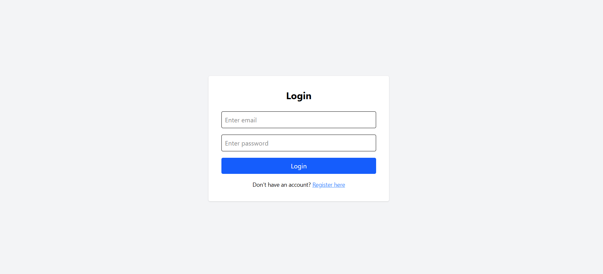
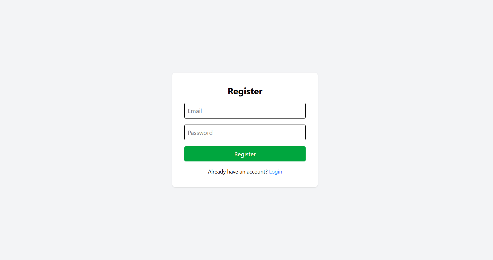
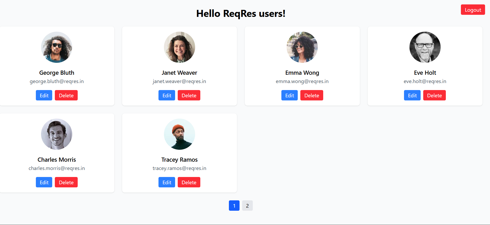

# EmployWise Frontend Assignment

This is a simple React-based user management app built for the EmployWise frontend assignment. It integrates with the [ReqRes API](https://reqres.in/) to demonstrate login, fetching user data, pagination, and user edit/delete functionality.

## 🚀 Features

✅ Login using mock credentials  
✅ Protected route with token authentication  
✅ List of users with responsive card UI  
✅ Pagination support  
✅ Edit user (first name, last name, email)  
✅ Delete user  
✅ Logout functionality  
✅ Mobile-responsive and clean UI using TailwindCSS  

## 🧰 Tech Stack

- ⚛️ React (Vite)
- 📦 Axios
- 🔄 React Router DOM
- 🎨 Tailwind CSS
- 🌐 ReqRes API (Fake REST API)

## 🔐 Login Credentials (as per ReqRes API)

Email: eve.holt@reqres.in
Password: cityslicka

## 📦 Installation & Setup

### 1. Clone the repo

- git clone https://github.com/your-username/employwise-assignment.git
  
- cd employwise-assignment

### 2. Install dependencies

npm install

### 3. Run the development server

npm run dev

## 🔐 Route Protection
- After login, a token is stored in localStorage

- /users and /edit/:id pages are protected and redirect to / if no token is found

## ✅ Usage Flow
- Login with valid credentials

- On success, navigate to the user list page

- Click Edit to update a user’s details (name/email)

- Click Delete to remove a user

- Use the Logout button (top-right) to clear the session

#### 📎 Credits
- ReqRes.in — Fake REST API for testing

- Tailwind CSS — For styling

- React Router — For navigation

- Axios — For HTTP requests

## 🖼️ Screenshots

### 🔐 Login Page

### 👤 Users Page

### ✏️ Edit Modal

### 👨‍💻 Author
Naveen — 2024 Graduate passionate about frontend development.

Feel free to connect with me on LinkedIn

## 📌 License
This project is licensed for educational use.
